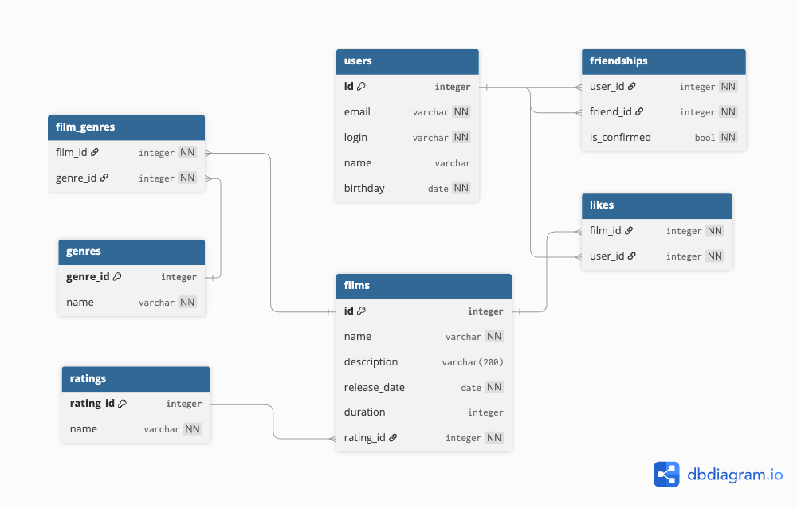

# 🎬 Filmorate — Movie Recommendation REST API

**Filmorate** — это REST API сервис для рекомендаций фильмов с возможностью ставить лайки, добавлять и удалять друзей, а также получать список популярных фильмов.  
Проект разработан на Spring Boot на основе многослойной архитектуры и работы с JDBC.

---

## 🏆 Реализованный функционал

### Фильмы
- CRUD для фильмов с поддержкой жанров и MPA-рейтингов
- Добавление и удаление лайков
- Получение списка популярных фильмов с подсчётом лайков

### Пользователи
- CRUD для пользователей
- Добавление и удаление друзей
- Получение списка друзей и общих друзей между пользователями

### Справочники
- Жанры: получение всех или по ID
- MPA рейтинги: получение всех или по ID

---

## 🛠 Технологический стек

- **Язык:** Java 21  
- **Фреймворк:** Spring Boot 3 (Web, Validation, JDBC)  
- **База данных:** H2 (in-memory)  
- **Инструменты:** Maven, Lombok, Logbook, Checkstyle  

---

## 🧱 Архитектура проекта

Проект реализован по многослойной архитектуре:
Controller → Service → Repository → Database

- **Controller** — REST API и эндпоинты
- **Service** — бизнес-логика, валидация и обработка ошибок
- **Repository** — работа с БД через NamedParameterJdbcOperations
- **Database** — in-memory H2 с таблицами для фильмов, пользователей, лайков, жанров и рейтингов

## ▶ Запуск проекта

### Сборка

```bash
mvn clean package
```

### Запуск

```
mvn spring-boot:run
```
или

```
java -jar target/filmorate-0.0.1-SNAPSHOT.jar
```

API будет доступно по адресу:
```
http://localhost:8080
```

## 📡 API Эндпоинты

### Фильмы

```
GET     /films
GET     /films/{id}
POST    /films
PUT     /films
PUT     /films/{id}/like/{userId}
DELETE  /films/{id}/like/{userId}
GET     /films/popular?count=10
```

### Пользователи

```
GET     /users
GET     /users/{id}
POST    /users
PUT     /users
PUT     /users/{id}/friends/{friendId}
DELETE  /users/{id}/friends/{friendId}
GET     /users/{id}/friends
GET     /users/{id}/friends/common/{otherId}
```

### Жанры

```
GET     /genres
GET     /genres/{id}
```

### MPA рейтинги

```
GET     /mpa
GET     /mpa/{id}
```

# Диаграмма базы данных


